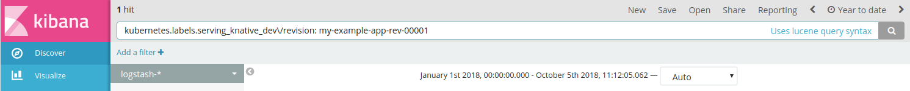

# Accessing log files

Depending on the monitoring plugin that is installed, you can view
and visualize your log files using Elasticsearch and Kibana, or
Stackdriver Logging.

## Table of contents

* [Before you begin](#before-you-begin)
* [Accessing logs with Elasticsearch and Kibana](#accessing-log-files-with-elasticsearch-and-kibana)
* [Accessing logs with Stackdriver Logging](#accessing-log-files-with-stackdriver-logging)

## Before you begin

You must have one of the monitoring plugins installed and configure in your
Knative cluster. For details, see
[Installing the Monitoring, Logging, and Tracing Plugin](./installing-logging-metrics-traces.md).

## Accessing log files with Elasticsearch and Kibana

If you have the monitoring plugin for Elasticsearch installed, you can use
Kibana to view and visualize your log files. If you are unsure, you can
[check to see which monitoring plugin is installed in your cluster](./installing-logging-metrics-traces.md#viewing-which-monitoring-plugin-is-installed).

Before you can use Kibana, you must first configure index
patterns for the indices that exist in Elasticsearch.

The typical work flow for viewing log files with Elasticsearch and Kibana is:

1. [Start Kibana](#1-starting-kibana).
1. [Configure index patterns](#2-configuring-index-patterns).
1. [View your log files](#3-viewing-log-files).

<!-- mdemirhan@ TODO: create a video walkthrough of the Kibana UI -->
---------------------

### 1. Starting Kibana

To use Kibana, you must start a proxy server:

1. Start a local proxy for the Kibana UI by running the following command:

   ```shell
   kubectl proxy
   ```

   Kibana uses port `8001`. For security, Kibana is only accessible within the
   cluster.

1. Access Kibana through your browser by navigating to:
   http://localhost:8001/api/v1/namespaces/knative-monitoring/services/kibana-logging/proxy/app/kibana

   Note: It might take a minute for the proxy server to start.


### 2. Configuring index patterns

Before you can use Kibana, you need to configure index patterns that identify
the indices that exist in Elasticsearch. After index patterns are initially
configured, you only need perform this step when you want to add new or modify
existing patterns.

For Knative, you should configure index patterns for the following indices:

  * `Logstash` - Index for application logs.
  * `Zipkin` - Index for request traces.

To create index patterns:

1. After [starting and opening Kibana](#1-starting-kibana), open the
   'Configure an index pattern' page:

   * If you have not specified any index patterns, the
     [Configure an index pattern](http://localhost:8001/api/v1/namespaces/knative-monitoring/services/kibana-logging/proxy/app/kibana#/management/kibana/indices)
     page opens by default.

   * To navigate to the [Configure an index pattern](http://localhost:8001/api/v1/namespaces/knative-monitoring/services/kibana-logging/proxy/app/kibana#/management/kibana/indices)
     page, you click **Management** > **Index Patterns**.

1. Individually configure an index pattern by entering the corresponding
   Elasticsearch index in **Index pattern**. You should append the `*`
   wildcard to match all variants, for example: `logstash-*` or `zipkin*`.

1. In **Time Filter field name**, indicate the value of the global time
   that you want to use to filter the logged events.

   Examples:
   * For `logstash-*`, use the `@timestamp` time filter.
   * For `zipkin*`, use the `timestamp_millis` time filter.

   Tip: More `field names` become available as events are ingested and those
   names are discovered in the log files.

1. Click `Create` to save the index pattern.

   

1. To configure another index pattern, click **Create Index Pattern** near
   the top of the page to reopen the
   [Configure an index pattern](http://localhost:8001/api/v1/namespaces/knative-monitoring/services/kibana-logging/proxy/app/kibana#/management/kibana/index)
   page.

### 3. Viewing log files

After [starting Kibana](#1-starting-kibana) and
[initially configuring index patterns](#2-configuring-index-patterns), you can use
the various pages in Kibana to view, graph, and visualize your logs.

You can open one of the following pages depending on how you want to view your
log files:

 * Use the
   [Discover](http://localhost:8001/api/v1/namespaces/knative-monitoring/services/kibana-logging/proxy/app/kibana#/discover)
   page to run search queries, filter, and view details about the events in your
   log files, including
   [viewing the events of your Knative resources](#viewing-log-files-for-knative-resources).

   At the top of the `Discover` page, you can use the controls to search
   or view log files within a specific time range:

   

 * Use the [Visualize](http://localhost:8001/api/v1/namespaces/knative-monitoring/services/kibana-logging/proxy/app/kibana#/visualize)
   page to create, view, and compare the your log file data in charts, tables,
   and more.

 * Use the [Graph](http://localhost:8001/api/v1/namespaces/knative-monitoring/services/kibana-logging/proxy/app/graph)
   page to create and view graphs and explore connections in your log file data.

[Learn more about Kibana](https://www.elastic.co/guide/en/kibana/current/index.html).

#### Viewing log files for Knative resources

Use the
[Discover](http://localhost:8001/api/v1/namespaces/knative-monitoring/services/kibana-logging/proxy/app/kibana#/discover)
page of Kibana to run search queries and view the events of your
[Knative resources](https://github.com/knative/serving/blob/master/docs/spec/overview.md).

In Kibana, you can view the logged events by either:

 * Using the list of **Available Fields** to filter by field type. You click
   **Add** within each field to select and add each field to the view.

 * Running a search query:

   * **Build, Configuration, or Revision resources**: Use the following search queries,
     where `[UNIQUE_RESOURCE_NAME]` is the unique name of the Knative resource. To obtain the
     name of a resource, you can run the `kubectl get [RESOURCE_TYPE]` command, where `[RESOURCE_TYPE]`
     is either `build`, `configuration`, or `revision`.

       | Knative Resource      | Search Query           |
       | --------------------- | ---------------------- |
       | [Build][1]          | `kubernetes.labels.build\-name: [UNIQUE_RESOURCE_NAME]` |
       | [Configuration][2]  | `kubernetes.labels.serving_knative_dev\/configuration: [UNIQUE_RESOURCE_NAME]` |
       | [Revision][3]       | `kubernetes.labels.serving_knative_dev\/revision: [UNIQUE_RESOURCE_NAME]` |

       Tip: Your `Build` resource names are also located in their
       [`.yaml` configuration files](https://github.com/knative/docs/blob/master/build/builds.md#syntax).

    * **Requests**: To view the log files for requests, you search:

      ```
      tag: "requestlog.logentry.istio-system"
      ```

      Requests in Knative are managed by the Istio service mesh and logs files are located within the
      `istio-system` [namespace][4]. To learn how to trace requests, see [Accessing Traces](./accessing-traces.md).

    [1]:https://github.com/knative/docs/tree/master/build
    [2]:https://github.com/knative/serving/blob/master/docs/spec/spec.md#configuration
    [3]:https://github.com/knative/serving/blob/master/docs/spec/spec.md#revision
    [4]:https://kubernetes.io/docs/concepts/overview/working-with-objects/namespaces/

### Examples

Use the following examples to learn how to search the log files for details
about your Knative resources.

#### Build, Configuration, or Revision resource examples

This example demonstrates how to access the log files for a Revision resource
but the steps are similar for the Build and Configuration resources:

1. If you run the following `kubectl get` command, all of the unique
   names of your Revisions are listed:

    ```shell
    kubectl get revision
    ```

    Example result:

    ```shell
    NAME                       AGE
    my-example-app-rev-00001   8d
    ```

1. You can then use the unique resource name to search and view all the logged events in Kibana. For example,
   you search `kubernetes.labels.serving_knative_dev\/revision: my-example-app-rev-00001` in the
   [Discover](http://localhost:8001/api/v1/namespaces/knative-monitoring/services/kibana-logging/proxy/app/kibana#/discover)
   page to view events for the `my-example-app-rev-00001` revision:

    

#### Requests example

This example demonstrates how you can retrieve and view the log files
for all the requests within a particular revision in Knative.

To list all the of the requests, you can run the
following search query in the
[Discover](http://localhost:8001/api/v1/namespaces/knative-monitoring/services/kibana-logging/proxy/app/kibana#/discover)
page:

  ```text
  tag: "requestlog.logentry.istio-system"
  ```

If you click on an event in that list, you might see details similar to the
following example request, including the name of the Knative revision,
`configuration-example-00001`, and the corresponding
`route-example.default.example.com` host name:

  ```text
  @timestamp                   July 10th 2018, 10:09:28.000
  destinationConfiguration     configuration-example
  destinationNamespace         default
  destinationRevision          configuration-example-00001
  destinationService           configuration-example-00001-service.default.svc.cluster.local
  latency                      1.232902ms
  method                       GET
  protocol                     http
  referer                      unknown
  requestHost                  route-example.default.example.com
  requestSize                  0
  responseCode                 200
  responseSize                 36
  severity                     Info
  sourceNamespace              istio-system
  sourceService                unknown
  tag                          requestlog.logentry.istio-system
  traceId                      986d6faa02d49533
  url                          /
  userAgent                    curl/7.60.0
  ```

## Accessing log files with Stackdriver Logging

If you have the monitoring plugin for Stackdriver installed, you can use the
'Stackdriver Logging' page in Google Cloud Platform to view and visualize
your log files: [**Go To Stackdriver Logging**](https://console.cloud.google.com/logs/viewer)

  

Tip: If you are unsure, you can
[check to see which monitoring plugin is installed in your cluster](./installing-logging-metrics-traces.md#viewing-which-monitoring-plugin-is-installed).

[Learn more about Stackdriver Logging](https://cloud.google.com/logging/docs/).

---

Except as otherwise noted, the content of this page is licensed under the
[Creative Commons Attribution 4.0 License](https://creativecommons.org/licenses/by/4.0/),
and code samples are licensed under the
[Apache 2.0 License](https://www.apache.org/licenses/LICENSE-2.0).
